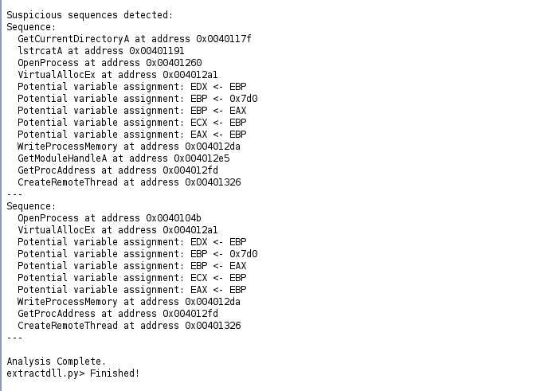

# 🚀 InjecHunter: Malicious DLL Injection Detection Using Ghidra
**A Powerful Journey Through Binary Analysis and Malware Detection**
A static code analysis framework built with Ghidra to detect malicious DLL injection techniques by identifying suspicious API call sequences in binaries.
Here’s a revamped, engaging version of the README. I've added a conversational tone and highlights to make the content more appealing and interesting to readers.

---

## 👀 Overview  
Ever wondered how hackers slip their malicious code into your programs? Enter **DLL Injection**, a sneaky yet powerful technique to exploit software. This project dives deep into the heart of binary files using **Ghidra**, the open-source reverse engineering superhero, to **detect and expose malicious DLL injections**.  

Through **static code analysis**, we unravel suspicious API call sequences, helping you fortify systems against these silent infiltrators. Let’s turn the tables on malware—one binary at a time!  

---

## ✨ Features  
🔥 **Static Code Analysis**: Dissect binaries without running them, keeping the analysis safe and secure.  
⚡ **Custom Scripts**: Supercharge your detection with Ghidra scripts tailored for API sequence hunting.  
📊 **Visual Evidence**: Detailed logs, highlighted sequences, and screenshots bring clarity to every detection.  
🎯 **High Accuracy**: With **97% accuracy** and an **F1-Score of 0.89**, it’s a reliable malware detective.  

---

## 🧩 The Problem  
**Dynamic-Link Libraries (DLLs)**: Tools for software efficiency or gateways for malicious intent?  
Hackers exploit DLLs to inject unauthorized code, execute remote commands, or escalate privileges. This project arms you with the tools to detect such vulnerabilities **before they wreak havoc**.  

---

## 🛠️ How It Works  
1. **Set the Stage**  
   - Environment: **Kali Linux**, **Ghidra**, and a dataset of 39 binaries (5 malicious, 34 benign).  

2. **Analyze**  
   - Extract **API call sequences**.  
   - Compare them against **known malicious patterns** like:  
     - **OpenProcess** → **VirtualAllocEx** → **WriteProcessMemory** → **CreateRemoteThread**.  

3. **Detect**  
   - Spot suspicious sequences.  
   - Highlight where the binaries go wrong.  

4. **Validate**  
   - Metrics like **Precision**, **Recall**, and **F1-Score** tell you just how good your detection is.  

---

## 🔍 Results That Speak  
- **True Positives**: 4  
- **False Positives**: 0 (Yes, zero!)  
- **Accuracy**: 97%  

  

---

## 🎯 Real-World Case Studies  

### **1️⃣ Remote Thread Injection**
- Binary: **Lab12-01.exe**  
- Malicious Sequence:  
  - **VirtualAllocEx** → **WriteProcessMemory** → **CreateRemoteThread**.  
  


---

### **2️⃣ Privilege Escalation**  
- Binary: **inject.exe**  
- Malicious Sequence:  
  - **OpenProcessToken** → **AdjustTokenPrivileges** → **LoadLibraryA**.  
  

---

### **3️⃣ Benign Binary (All Clear)**  
- Binary: **rundll32.exe**  
- Result:  
  - No suspicious sequences found.  
  

---

## 📦 Getting Started  
### Prerequisites  
- Install **Ghidra** from its [official site](https://ghidra-sre.org/).  
- Make sure you have **Python 3.x** installed.  

### Setup  
1. Clone the repository:  
   ```bash
   git clone https://github.com/your-username/dll-injection-detection.git
   ```  
2. And start playing around with the scripts! 
---

## 🖥️ How to Use  
1. **Run the Analysis**  
   ```bash
   ./run_analysis.sh
   ```  
2. **Inspect Results**  
   - Results are saved in `detection_results.csv`.  
   - Check logs and screenshots for detected patterns.  

---

## ⚙️ Scripts That Power the Magic  
- **ExtractDLL.py**: Finds suspicious API call sequences in binaries.  
- **ExtractnImport2CSV.py**: Converts logs into CSV format for easy analysis.  
- **CalculateF1Score.py**: Computes Precision, Recall, and F1-Score.  

---

## 🚀 What’s Next?  
🔗 **Dynamic Analysis**: Take it a step further and catch runtime behavior.  
📈 **Expand the Dataset**: Analyze more binaries, including obfuscated samples.  
💡 **Smarter Matching**: Handle fragmented API sequences with advanced algorithms.  

---
Here’s the friendly yet formal version for the warning:

---

## ⚠️ Important Note  
Some sample files for DLL injection might not be directly downloadable from this repository.  

If you experience any issues, please visit my **[forked PracticalMalwareAnalysis-Labs repository](https://github.com/fatemameem/PracticalMalwareAnalysis-Labs)** and download the zip file.  
Once downloaded, extract the files and use the **sample DLL files from Chapter 12** for your testing purposes.  

Feel free to reach out if you need further assistance! 😊

---

Let me know if you want to tweak it further!

---

## 🤝 Contributing  
We’re building a community of defenders! Feel free to fork, enhance, and submit pull requests. Let’s make DLL injection detection unstoppable.  

---

## 📜 License  
This project is licensed under the **MIT License**.  

---

Ready to dive into the world of malware detection? Clone the repo, and let’s expose some injections! 💻✨  

Let me know if you'd like to customize it further or tweak any sections! 😊
